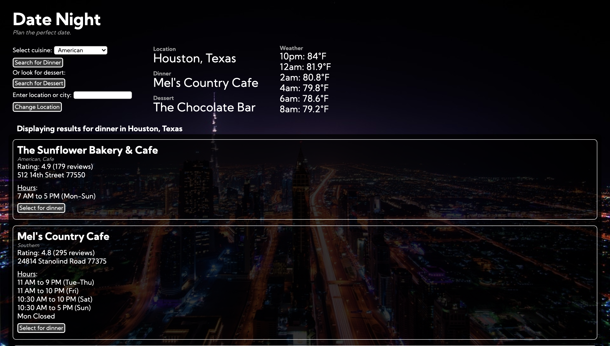

# Date Night

## Live

[https://jessetran03.github.io/date-night/](https://jessetran03.github.io/date-night/)

## Screenshots

Initial Page:

Results Page:

## Summary

An application to plan the perfect date for a night. Users can choose a location to view the upcoming weather forecast for that location as well as search for restaurants by cuisine or dessert at that location. The user can add a restaurant for dinner and a restaurant for dessert from the results to their plan.

## Technologies Used

1. HTML
2. CSS
3. JavaScript
4. jQuery
